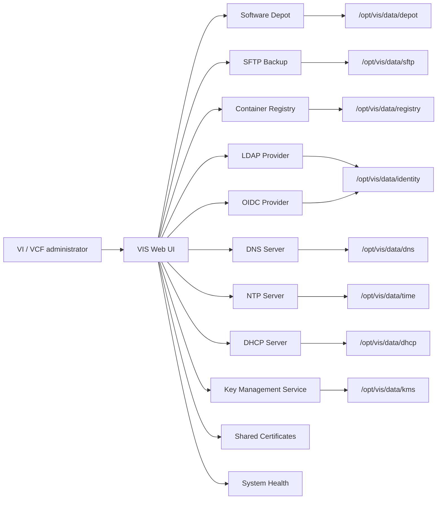

# Architecture

VIS is an Ubuntu-based virtual appliance with a web management UI and local service adapters. The UI stores appliance state in SQLite and manages backend services through explicit adapters so services can be configured, enabled, restarted, disabled, and health checked from one control plane.

## Table of Contents

- [Data Layout](#data-layout)
- [State](#state)



## Data Layout

The default service disks are:

| Disk | Mount | Size |
| --- | --- | --- |
| Disk 1 | OS | 40 GB |
| Disk 2 | `/opt/vis/data/depot` | 200 GB |
| Disk 3 | `/opt/vis/data/sftp` | 15 GB |
| Disk 4 | `/opt/vis/data/registry` | 60 GB |
| Disk 5 | `/opt/vis/data/dns` | 2 GB |
| Disk 6 | `/opt/vis/data/identity` | 2 GB |

Each service data path is on its own native Proxmox virtual disk so a busy depot or registry can be expanded without consuming space from another VIS service. The template uses raw VirtIO-SCSI disks directly on the selected PVE storage; it is not derived from VMDK media.

By default VIS stores application state in:

```text
/opt/vis/state/vis.db
```

Set `VIS_DB_PATH` for local development and tests.
